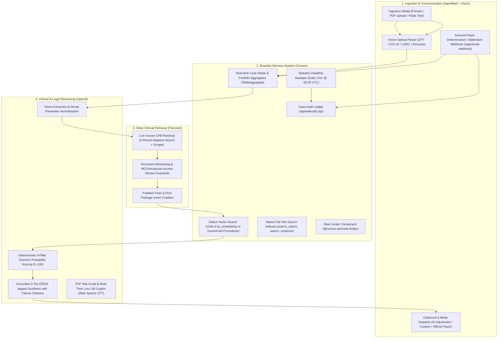

# ClaimHero — Autonomous Medical & Health Insurance Appeal Sentinel

> **Autonomous Appeal Sentinel for Convex "All Gas" Hackathon**  
> Built with **Convex** (Reactive Database, Native 1536-d Vector Search, Full-Text Search Indexes, Scheduled Crons, File Storage, Auth & Official Components), **Firecrawl** (Live Insurer Clinical Policy Bulletins, PubMed & FDA Indications Crawler), **AgentMail** (Dedicated Two-Way Inbound/Outbound Appellate Inboxes & Autonomous Payer Gateways), and **OpenAI** (Vision Denial Extraction, Deterministic 4-Pillar Scoring & Grounded Appeal Synthesis).

---

## 1. Executive Summary & Problem Statement

In the U.S. healthcare system, health insurers improperly deny approximately **1.5 Billion medical claims and prior authorizations** every year, denying over **$200 Billion** in care (Aetna, Cigna, UnitedHealthcare, Blue Cross Blue Shield, Humana, Molina, Medicare Advantage).

### The Real-World Crisis
1. **Asymmetric Information & Buried Clinical Policies**: Insurers reject claims citing opaque codes (e.g., *CO-50: Non-covered service / Not Medically Necessary*, *CO-197: Prior-authorization absent*, *CO-16: Lacks information*). The actual criteria are buried inside 150KB+ Clinical Policy Bulletins (CPBs) and MCG/Carelon manuals that patients and clinic staff cannot easily find.
2. **Statutory Time Bombs**: Patients and healthcare providers have strict statutory appeal windows (**ERISA 180-day federal deadline** under 29 CFR § 2560.503-1, state 30-day external review clocks). Missing a deadline forfeits all rights to recover tens of thousands of dollars.
3. **High Overturn Rate, Low Appeal Rate**: Over **70% of formally appealed denials are overturned and paid** when backed by specific payer policy citations, FDA package inserts, and peer-reviewed clinical guidelines. Yet less than **1% of patients appeal** due to administrative exhaustion and legal complexity.

**ClaimHero** turns every denial into a cited, dispatch-ready appeal packet in under 90 seconds: an autonomous sentinel that ingests denial notices, crawls live insurer policy bulletins, matches 1536-d legal precedents, scores overturn probability with a deterministic 4-pillar rubric, synthesizes multi-tier ERISA briefs, arms physicians with real-time P2P Live Call Copilots, audits statutory $110/day failure-to-disclose penalties, de-identifies HIPAA PII, compiles court-ready exhibit binders, and autonomously transmits dossiers through dedicated AgentMail gateways.

---

## 2. Technology Stack & Integration Architecture



### Component Synergy Across the 4 Pillars
* **Convex**:
  * **Reactive Subscriptions (`useQuery`)**: Live appeal case tracker, evidence matrix, countdown timers, and portfolio metrics updating in real time with zero polling.
  * **Native Vector Search (`precedents.vectorIndex`)**: 1536-d cosine vector index (`by_embedding`) matching denied CPT/ICD/CARC codes against historical winning legal precedents, ranked by code overlap.
  * **Native Full-Text Search (`searchIndex`)**: Server-side lexical search on `claims` (`search_claims`), `clinicalEvidences` (`search_evidence`), and `precedents` (`search_precedents`).
  * **Official Components**: `@convex-dev/rate-limiter` for token-bucket API protection, `@convex-dev/aggregate` TableAggregate for O(log N) portfolio statistics, `@convex-dev/auth` for Google OAuth and password authentication.
  * **Scheduled Crons & Actions**: Nightly statutory deadline sweepers recalculating remaining appeal days and emitting critical alerts.
  * **Convex File Storage**: Secure storage for uploaded denial letters, generated exhibit PDFs, and AgentMail attachments.
* **Firecrawl**:
  * Scrapes live insurer Clinical Policy Bulletins (e.g. Molina, Carelon, Aetna, UHC, Cigna, BCBS) using `v2/search` and `v2/scrape`.
  * Multi-layer hardening: document windowing for 150KB+ clinical manuals, private MCG viewer rejection, payer domain verification, and Incapsula/CAPTCHA access-denied filtering.
  * Specialized secondary crawlers for PubMed/ClinicalTrials.gov literature and FDA package inserts (`accessdata.fda.gov`).
* **AgentMail**:
  * Dedicated autonomous mailboxes: Outbound Sender (`claimhero-sender@agentmail.to`) and AI Adjudicator (`claimhero-adjudicator@agentmail.to`).
  * **Inbound**: Fast asynchronous webhook (`/agentmail-webhook`) processing insurer determinations and correspondence replies.
  * **Outbound**: 3-mode appellate transmission gateway (AI Adjudicator simulation, custom test email, or verified official payer address with portal/fax/PO box routing).
* **OpenAI**:
  * `gpt-5.4-nano` structured extraction for EOB parameters (claim number, provider, denied amount, patient liability, CPT, ICD-10, CARC codes, deadlines).
  * Deterministic 4-pillar scoring algorithm (35% CPB + 25% Step-Therapy + 20% ERISA + 20% Precedents = 100).
  * Grounded legal brief synthesis using verified clinical facts and cited policy clauses, with automatic 3-tier escalation posture.
  * Real-time P2P Live Call Copilot generating instant Fast Answer rebuttal cards against AI Medical Director challenge traps.

---

## 3. Data Schema Design (Convex)

`convex/schema.ts` defines 8 core domain tables with secondary indexes, full-text search indexes, and vector indexes:

1. **`patients`**:
   * `userId`, `name`, `email`, `memberId`, `groupNumber`, `insurancePayer`, `state`, `createdAt`.
   * Indexes: `by_user`, `by_member_id`, `by_insurance_payer`.
2. **`claims`**:
   * `userId`, `patientId`, `claimNumber`, `serviceDate`, `providerName`, `deniedAmount`, `patientOwedAmount`.
   * `cptCodes`, `icd10Codes`, `denialReasonCode`, `denialReasonDescription`, `status`, `statutoryDeadline`, `daysRemaining`.
   * `overturnProbabilityScore`, `riskLevel`, `scoringBreakdown`, `assignedAgentEmail`, `agentMailInboxId`, `agentMailInboxEmail`.
   * `denialLetterStorageId`, `appealContext` (sender, clinicalFacts, physicianNotes), `payerContact` (officialAppealsEmail, intakePortalUrl, appealsFax, statutoryPoBox, ediPayerId).
   * `redactionMetadata`, `financialLiability`, `erisaPenalties`.
   * Indexes: `by_user`, `by_user_status`, `by_patient`, `by_claim_number`, `by_status`, `by_deadline`, searchIndex `search_claims`.
3. **`clinicalEvidences`**:
   * `claimId`, `sourceType` (`payer_cpb`, `pubmed_study`, `fda_label`, `legal_precedent`), `title`, `sourceUrl`, `citationClause`, `extractedEvidenceMarkdown`, `relevanceScore`.
   * Indexes: `by_claim`, searchIndex `search_evidence`.
4. **`appeals`**:
   * `claimId`, `version`, `appealLevel` (`level_1_internal`, `level_2_grievance`, `level_3_external_state_review`), `statutoryPosture`, `targetAuthority`, `legalAggressiveness`, `statutoryAuthorities`.
   * `executiveSummary`, `medicalNecessityArguments`, `legalCitations`, `fullAppealMarkdown`, `pdfExportStorageId`.
   * Indexes: `by_claim`, `by_claimId_and_version`, `by_claimId_and_appealLevel`.
5. **`emailThreads` & `emailMessages`**:
   * `claimId`, `agentEmail`, `payerEmail`, `subject`, `status`.
   * `threadId`, `direction` (`inbound`, `outbound`), `sender`, `recipient`, `bodyHtml`, `bodyText`, `sentAt`.
   * Indexes: `by_claim`, `by_thread`.
6. **`precedents`** (Vector Archive):
   * `sourceKind`, `title`, `citation`, `jurisdiction`, `icd10Codes`, `cptCodes`, `carcCodes`, `outcome`, `winningArgument`, `statutoryLanguage`, `embedding` (1536 dimensions), `corpusKey`.
   * Indexes: `by_corpus_key`, `by_primary_cpt`, `by_primary_carc`, searchIndex `search_precedents`, vectorIndex `by_embedding` (1536-d, cosine).
7. **`appealAuditLogs`**:
   * `claimId`, `eventType`, `actor`, `details`, `timestamp`.
   * Indexes: `by_claim`, `by_event_type`.
9. **`p2pScripts` & `p2pCallSessions`**:
   * `claimId`, `version`, `openingStatutoryStatement`, `clinicalPolicyCitations`, `disqualificationCounters`, `badFaithDemands`, `closingDemand`.
   * `sessionStatus`, `transcripts`, `fastAnswers`, `checklistProgress`, `winScore`.
   * Indexes: `by_claim`, `by_session`.
10. **`chatbotSessions` & `chatbotMessages`**:
    * `sessionId`, `userId`, `claimId`, `title`, `summary`, `status`.
    * `role` (`user`, `assistant`, `system`), `content`, `toolCalls` (name, arguments, output).
    * Indexes: `by_user`, `by_claim`, `by_session`.

---

## 4. UI / UX Design: Clinical Defense Command Center

### Aesthetic Direction: Precision Medical Dark Mode
* **Palette**: Obsidian canvas (`#0b0f17`), cyan primary (`#0ea5e9`), emerald victory highlights (`#10b981`), amber warning badges (`#f59e0b`), and crimson statutory alerts (`#f43f5e`).
* **Glassmorphism**: Backdrop blur filters (`backdrop-blur-md`, `bg-card/75`), thin border styling (`border-border/50`), and mono tabular numbers (`tabular-nums`) for currency and date precision.

### Key Layout Modules
1. **Cinematic Hero**: Full-screen ambient medical background video, showcase navigation, liquid-glass CTAs, and instant authentication routing.
2. **Case Radar & Real-Time Pipeline**: Filterable table of all active claims, status tabs, payer breakdown, circular statutory countdown gauges (`DeadlineCountdown.tsx`), and RFC 4180 CSV / JSON portfolio export.
3. **Clinical Evidence Matrix**: Side-by-side denial vs. CPB inspector, 4-pillar score breakdown bars, category filter pills (CPB / PubMed / FDA / ERISA), and live 1536-d vector precedent feed.
4. **Defense Suite**:
   * **Legal Appeal Brief (`AppealStudio.tsx`)**: Split-pane markdown editor and preview, 3-tier escalation stepper, Section Outline Jump Bar, and 1-click ERISA § 502(c) penalty embedding.
   * **Doctor P2P Defense Studio (`P2PDefenseStudio.tsx`)**: 3-minute tele-script, bad-faith written denial demands, and Pocket Clinic Cheat Sheet with dedicated `@media print` styling.
   * **P2P Live Call Copilot (`P2PLiveCopilot.tsx`)**: Web Speech STT real-time transcription, AI Medical Director 3-stage challenge loop, Fast Answer rebuttal cards, win-score HUD, and copyable EHR Encounter Summary addendums (Epic/Cerner).
   * **Financial Liability Calculator (`FinancialLiabilityCalculator.tsx`)**: OOP-max capping, No Surprises Act balance billing protection, $110/day ERISA failure-to-disclose penalty trajectory, and printable audit statements.
   * **Court-Ready Dossier Binder (`dossier/`)**: Complete 8-page packet (Cover, TOC, Statutory Summary, Exhibit Index, Exhibits A-C, Attestation) with US Letter / A4 print isolation.
5. **Payer Communications Drawer (`AgentMailDrawer.tsx`)**: Multi-channel gateway (email / portal / fax / mail) with 3-mode recipient switching, verified payer routing, and threaded two-way correspondence.
6. **Portfolio Analytics (`AnalyticsMetrics.tsx`)**: Practice-wide disputed vs. recovered amounts, insurer win rates, confidence distribution, and printable Executive Report statements.
7. **HIPAA Privacy Redaction Engine (`PrivacyRedactionFilter.tsx`)**: Deterministic PII masking across Safe Harbor, Balanced Appellate, and Public Exhibit standards.
8. **Sentinel AI Copilot Widget (`SentinelChatbot.tsx`, `⌘J`)**: Autonomous clinical & legal chatbot with 10 agentic OpenAI tool calling capabilities across Convex database records (`get_active_claim_details`, `get_clinical_evidence`, `get_appeal_brief`, `get_p2p_defense_script`, `get_audit_trail`, `search_precedents`) and live Firecrawl web intelligence (`firecrawl_web_search`, `firecrawl_scrape_url`, `crawl_and_attach_evidence`), persistent `chatbotSessions`/`chatbotMessages` Convex tables, rolling context window summarization, and collapsible tool execution traces.

---

## 5. Verification & Test Engineering

ClaimHero enforces rigorous automated test coverage (~81.3% lines across all modules, 100% across core libraries and utilities) and strict quality verification across every tier:

```bash
npm run typecheck       # Strict TypeScript typechecking (tsc --noEmit)
npm run lint            # ESLint static code analysis
npm run test            # Vitest automated test execution (920 tests across 57 suites)
npm run test:coverage   # Vitest with @vitest/coverage-v8 (~81.1% line coverage)
npm run build           # Vite production bundle build
npm run verify          # Full automated gate (typecheck + lint + test:coverage + build)
```

### Verified Test Suites (920 Tests / 57 Suites)
* `tests/claimhero.test.ts` (70 tests): End-to-end integration, 4-pillar scoring rubric, ERISA deadline sweeps, and portfolio aggregates.
* `tests/agentMail.test.ts` (67 tests): AgentMail outbound dispatch, webhook normalization, email styling, Svix signature verification, and AI adjudicator addressing.
* `tests/authorization.test.ts` (40 tests): Convex multi-tenant document isolation, owner verification, cross-tenant IDOR guards, and spending protection.
* `tests/actionsPolicyAndSynthesizer.test.ts` (30 tests): Firecrawl policy scraping, guideline fallback handling, and appeal synthesizer action contracts.
* `tests/convexAppeals.test.ts` (30 tests): Multi-tier statutory appeal escalation, revision preservation, and draft lifecycle.
* `tests/collaboration.test.ts` (26 tests): Case sharing invitations, collaborator roles (editor/viewer), and pending invite gating.
* `tests/securityComplianceHardening.test.ts` (25 tests): Unauthenticated optical parsing denial, IDOR patient isolation, honest name resolution, and dispatch blocking.
* `tests/actionsAgentMailAndDispatcher.test.ts` (25 tests): Outbound appeal packet compilation, inbound claim reply routing, and cooldown deduplication.
* `tests/evidenceDossierUx.test.ts` (23 tests): Clinical research console modes, multi-source 3-pipeline telemetry, exhibit grouping, and clause inspector contracts.
* `tests/convexChatbot.test.ts` (23 tests): Agentic tool definitions, chat sessions, rolling summarization, and token-bucket rate limits.
* `tests/convexEmails.test.ts` (22 tests): Inbound/outbound email persistence, thread association, and security authorization.
* `tests/openai.test.ts` (20 tests): Structured completions, Vision OCR extraction, 1536-d vector embeddings, and retry resilience.
* `tests/yjsBrief.test.ts` (20 tests): Real-time CRDT document synchronization, snapshotting, and collaborative conflict resolution.
* `tests/useEvidenceFailFast.test.ts` (19 tests): Reactive evidence hooks, timeout handling, and fail-fast UX fallbacks.
* `tests/productionReadinessFixes.test.ts` (19 tests): Edge-case handling, error containment, and production hardening.
* `tests/convexHttp.test.ts` (19 tests): HTTP router endpoints, webhook verification, and payload routing.
* `tests/demoIsolationAndHonestPipelines.test.ts` (18 tests): Synthetic demo isolation, honest clinical basis validation, and real patient protection.
* `tests/workflows.test.ts` (18 tests): Durable background workflows, step resumption, and pipeline error recovery.
* `tests/convexClinicalEvidences.test.ts` (17 tests): Clinical evidence persistence, batch ingestion, and claim linkage.
* `tests/redactionEngine.test.ts` (17 tests): HIPAA Safe Harbor 18-identifier detection, boundary masking, street addresses, and custom terms.
* `tests/convexAuditLogsAndUsers.test.ts` (17 tests): Immutable statutory audit log timelines, ERISA Merkle verification query, and user profile persistence.
* `tests/financialErisaCalculator.test.ts` (15 tests): ERISA § 502(c) statutory penalties ($110/day), cost-sharing calculations, and severity tiers.
* `tests/visualProofArchive.test.ts` (15 tests): Firecrawl full-page screenshot archiving, signed URL resolution, and exhibit mapping.
* `tests/actionsClinicalAndParser.test.ts` (15 tests): Optical PDF intake parsing, clinical question generation, and payer gateway discovery.
* `tests/auditCryptoChain.test.ts` (19 tests): NIST SHA-256 rolling hash chain, tamper detection (alterations, backdating, deletions), unsealed block detection, and < 10ms benchmark.
* `tests/hybridSearchRRF.test.ts` (14 tests): Reciprocal Rank Fusion combining vector similarity and keyword search.
* `tests/auditTrailDrawer.test.ts` (17 tests): Case Audit Drawer, Cryptographic Proof of Case Integrity HUD, 1-click Verify Hash Chain button, and block seals.
* `tests/convexClaimsFull.test.ts` (14 tests): Comprehensive claim state machine transitions and cascading purge operations.
* `tests/actionsPrecedentsAndPipeline.test.ts` (13 tests): Precedent archive search, vector matching, and autonomous pipeline orchestration.
* `tests/pendingUploads.test.ts` (13 tests): Secure file upload sessions and storage ownership verification.
* `tests/radarExport.test.ts` (12 tests): HIPAA Safe Harbor export sanitization across 4 formats, entity masking, and technical audit exports.
* `tests/clientStatsAndSearch.test.ts` (12 tests): In-memory client statistics aggregation and search filtering.
* `tests/appealDossierBinder.test.ts` (11 tests): Dossier serialization, fallback exhibits, criteria violations, and 3-tier appellate escalation.
* `tests/utils.test.ts` (11 tests): Healthcare currency formatting, statutory countdown math, and risk badge resolvers.
* `tests/p2pLiveCopilot.test.ts` (11 tests): AI Medical Director 3-turn lifecycle, Fast Answer cards, and STT tolerance.
* `tests/convexPrecedents.test.ts` (11 tests): Precedent vector index retrieval, seeding, and deduplicated matching.
* `tests/convexSettings.test.ts` (11 tests): Adjudicator profile settings, practice credentials, and organization preferences.
* `tests/backendOptimizationsD1D7.test.ts` (10 tests): Bounded pagination, aggregate safeguards, and performance optimizations.
* `tests/appealYjs.test.ts` (10 tests): Yjs CRDT op-log transport, vector clocks, and snapshot persistence.
* `tests/autopilotSLA.test.ts` (10 tests): Automated SLA enforcement and statutory countdown monitoring.
* `tests/adversarialAdjudicator.test.ts` (10 tests): Adversarial payer response simulation and boundary validation.
* `tests/actionsP2PAndChatbot.test.ts` (9 tests): Physician P2P script generation and chatbot retrieval actions.
* `tests/ingestionAndDeletionPipeline.test.ts` (9 tests): Denial document ingestion and cascading resource deletion.
* `tests/convexP2P.test.ts` (9 tests): P2P call session records and defense script persistence.
* `tests/formalPdfAttachments.test.ts` (8 tests): Formal PDF legal memorandum assembly and court attachment generation.
* `tests/collabSync.test.ts` (8 tests): Multi-user collaborative state synchronization and presence tracking.
* `tests/soundEffects.test.ts` (7 tests): Procedural Web Audio API sound synthesis, 10 acoustic sentinel cues, and volume controls.
* `tests/routerAndUrlSync.test.ts` (7 tests): Deep-link URL routing, view synchronization, and browser history handling.
* `tests/statutoryEscalation.test.ts` (6 tests): 180-day internal appeal to Level 3 DOI escalation state machine.
* `tests/p2pDefense.test.ts` (6 tests): Tele-script generation, statutory openings, and pocket cheat sheet formatting.
* `tests/sentinelChatbot.test.ts` (6 tests): Agentic tool schemas, Firecrawl live search/scrape parameters, and prompt construction.
* `tests/pipelineActivity.test.ts` (5 tests): Real-time pipeline execution activity and milestone tracking.
* `tests/judgeUxAndHardening.test.ts` (5 tests): Hackathon judge preset validation and UX flow safeguards.
* `tests/sentinelAgent.test.ts` (5 tests): Autonomous agent tool orchestration and multi-step reasoning.
* `tests/sentinelDrawerAndTrigger.test.ts` (5 tests): Slide-out Sentinel Copilot drawer, keyboard shortcuts, focus trapping, and brief insertion.
* `tests/shortcutsRegistry.test.ts` (3 tests): Keyboard shortcut bindings and accessible navigation triggers.
* `tests/liabilityDefaultsEmptyState.test.ts` (3 tests): Empty-state rendering and default liability values.

---

## 6. Hackathon Alignment & Impact

| Judging Criterion | Alignment & Technical Depth |
|---|---|
| **Real-World Utility** | Directly tackles a $200B/year denial crisis. Produces production-ready, sendable artifacts (formal briefs, P2P call scripts, EHR clinical notes, and court dossiers) rather than generic chat summaries. |
| **Full-Stack Integration Depth** | All 4 sponsor platforms are deeply integrated: **Convex** (reactive DB, 1536-d vector search, searchIndex, scheduled crons, components), **Firecrawl** (live CPB scraping, PubMed, FDA), **AgentMail** (inbound webhooks, outbound dispatch, AI adjudicator), and **OpenAI** (Vision extraction, 4-pillar scoring, grounded synthesis). |
| **Technical Rigor & Polish** | 100% clean `npm run verify` gate, 920 automated tests across 57 test suites, strict TypeScript, responsive dark-mode UI with glassmorphism, and isolated `@media print` stylesheets. |
| **Transparency & Build Process** | Comprehensive `hackathon.md` log with UTC timestamps, reconciled 7-character commit hashes, and detailed milestone notes. |

---

<p align="center"><strong>ClaimHero — Turn Every Denial into a Cited, Dispatch-Ready Appeal in Under 90 Seconds.</strong></p>
