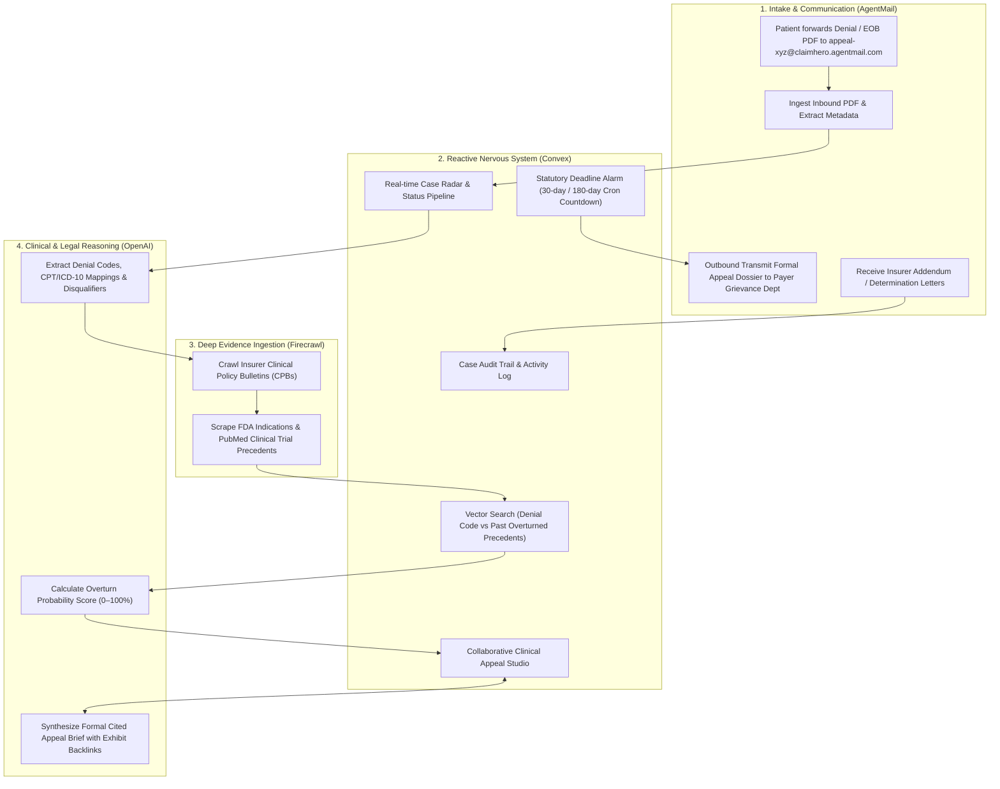

# ClaimHero — Autonomous Medical & Health Insurance Appeal Sentinel

> **Alternative Concept for Convex "All Gas" Hackathon**  
> Built with **Convex** (Reactive Case DB, Crons, Vector Search & Realtime Collaboration), **Firecrawl** (Insurer Clinical Policy & Medical Research Crawler), **AgentMail** (Autonomous Dedicated Appeal Inboxes & Payer Transmissions), and **OpenAI** (Clinical Reason Extraction & Cited Appeal Generation).

---

## 1. Executive Summary & Problem Statement

In the US healthcare system, **over $200 Billion** in medical claims and prior authorizations are improperly denied every year by health insurers (Aetna, Cigna, UnitedHealthcare, Blue Cross Blue Shield, Humana, Medicare Advantage).

### The Real-World Friction
1. **Asymmetric Information & Buried Clinical Policies**: Insurers reject claims citing vague internal codes (e.g., *"CO-50: Non-covered service / Not Medically Necessary"*, *"Experimental/Investigational"*). The actual criteria are buried inside 80-page Clinical Policy Bulletins (CPBs) that patients cannot find.
2. **Statutory Time Bombs**: Patients and independent medical practices have strict statutory appeal windows (e.g., **ERISA 180-day federal deadline**, state 30-day external review clocks). Missing a deadline by 24 hours forfeits the right to recover thousands of dollars.
3. **High Overturn Rate, Low Appeal Rate**: Over **70% of formally appealed insurance denials are overturned and paid** when backed by exact payer policy citations, FDA labels, and peer-reviewed clinical studies. Yet less than **1% of patients appeal** due to exhaustion and legal complexity.

**ClaimHero** levels the playing field: an autonomous medical appeal sentinel that ingests denial letters via email, crawls insurer policy bulletins and clinical trials, tracks statutory deadlines with Convex crons, and dispatches legally airtight, cited appeal briefs directly to payer grievance departments.

---

## 2. Technology Stack & Integration Architecture

### Component Synergy
* **Convex**:
  * **Reactive Subscriptions (`useQuery`)**: Live appeal case tracker updating instantly as clinical evidence is ingested and appeal drafts evolve.
  * **Vector Embeddings & Search**: Compares denied diagnosis/treatment codes (ICD-10, CPT) against a vector index of **past winning appeal strategies, overturned case templates, and clinical precedents**.
  * **Scheduled Actions & Crons**: Automated deadline trackers enforcing strict statutory appeal countdowns with escalation notifications.
  * **Collaborative Appeal Studio**: Live multi-user review where patients, doctors, and advocates edit appeal briefs with real-time cursor presence.
* **Firecrawl**:
  * Scrapes and parses major insurer Clinical Policy Bulletins (CPBs) for specific medical necessity criteria (e.g., Aetna CPB 0321, UHC Medical Policy 2024T001).
  * Ingests latest FDA drug indications, NCCN oncology guidelines, and PubMed clinical trial abstracts to prove standard of care.
* **AgentMail**:
  * Creates an autonomous dedicated email inbox for every claim (e.g. `appeal-claim-9402@claimhero.agentmail.com`).
  * **Inbound**: Listens for patient forwards (EOB attachments, medical records) and insurer decision letters.
  * **Outbound**: Automatically dispatches formal, HIPAA-compliant appeal packets with attached clinical exhibits directly to the insurer’s appeals department.
* **OpenAI**:
  * Parses complex medical explanation of benefits (EOBs), extracting claim numbers, disputed amounts, and denial reason codes.
  * Generates legal and medical appeal briefs citing exact insurer CPB clause numbers and statutory ERISA/state consumer protection statutes.

---

## 3. Data Schema Design (Convex)

### Tables:
1. `patients` / `providers`:
   * `name`, `email`, `memberId`, `groupNumber`, `insurancePayer` (e.g., "Aetna", "UnitedHealthcare", "BCBS"), `state`.
2. `claims` (The Core Appeal Case):
   * `patientId`, `claimNumber`, `serviceDate`, `providerName`, `deniedAmount`, `patientOwedAmount`.
   * `cptCodes` (procedure codes), `icd10Codes` (diagnosis codes), `denialReasonCode` (e.g., "CO-50", "CO-197").
   * `status` (`intake_received`, `analyzing_policy`, `evidence_assembled`, `appeal_drafted`, `dispatched`, `under_review`, `overturned_won`, `escalated_external`).
   * `statutoryDeadline` (timestamp), `daysRemaining` (computed via Convex cron).
   * `overturnProbabilityScore` (0–100), `riskLevel` (`high_confidence`, `moderate`, `complex_litigation`).
   * `assignedAgentEmail` (e.g., `appeal-case-8921@claimhero.agentmail.com`).
   * `denialLetterStorageId` (Convex File Storage ID for the original denial PDF).
3. `clinicalEvidences`:
   * `claimId`, `sourceType` (`payer_cpb`, `fda_package_insert`, `pubmed_study`, `nccn_guideline`).
   * `title`, `sourceUrl`, `citationClause`, `extractedEvidenceMarkdown`, `relevanceScore`, `vectorEmbedding`.
4. `appeals`:
   * `claimId`, `version`, `appealLevel` (`level_1_internal`, `level_2_grievance`, `level_3_external_state_review`).
   * `executiveSummary`, `medicalNecessityArguments`, `legalCitations`, `fullAppealMarkdown`, `pdfExportStorageId`, `lastEditedBy`.
5. `emailThreads` & `emailMessages`:
   * `claimId`, `agentEmail`, `payerEmail`, `officerName`, `subject`, `direction` (`inbound` / `outbound`), `bodyHtml`, `bodyText`, `hasAttachments`, `receivedAt`.
6. `appealAuditLogs`:
   * `claimId`, `eventType` (`denial_ingested`, `policy_crawled`, `overturn_score_computed`, `appeal_sent`, `decision_received`), `timestamp`, `details`.

---

## 4. UI / UX Design: Clinical Defense Command Center

### Aesthetic Direction: Precision Medical Dark-Mode
* **Palette**: Deep slate-charcoal canvas (`#0b0f17`), cyber cyan accents (`#00e5ff`), medical emerald victory highlights (`#10b981`), critical statutory crimson (`#f43f5e`), and amber warning badges (`#f59e0b`).
* **Typography**: Clean, ultra-crisp typography (Inter / Mono data tags) with high-contrast badge indicators.

### Key Layout Views:
1. **Live Claim Ingestion Radar**:
   * Real-time stream of incoming denial letters forwarded by patients/clinics with instant optical parsing status.
2. **Clinical Evidence Matrix & CPB Inspector**:
   * Side-by-side view of the Insurer Denial vs. Extracted Medical Policy Bulletin clauses (showing where the insurer violated their own published standards).
3. **Statutory Deadline Countdown Engine**:
   * Dynamic circular dials showing days remaining before ERISA / State Insurance Commissioner appeal rights expire.
4. **Autonomous AgentMail Case Drawer**:
   * Two-way chronological message feed tracking outbound appeal packets and inbound insurer acknowledgment/response letters.
5. **Interactive Bid/Appeal Studio**:
   * Real-time collaborative document editor with AI assistant ("Add FDA Clinical Trial Precedent", "Insert Physician Letter of Medical Necessity", "Cite ERISA 29 CFR § 2560.503-1").
6. **Real-time Case Analytics & Portfolio Oversight**:
   * Unified dashboard computing total disputed pipeline, won/recovered amounts, average overturn probabilities, and critical statutory deadline alerts across all live claims with zero hardcoded values.

---

## 5. Judge Presentation & 3-Minute Demo Video Blueprint

* **0:00 – 0:30 (The Trillion-Dollar Healthcare Injustice)**:
  * Highlight the staggering statistic: $200B in medical denials, 70% winnable on appeal, but 99% abandoned due to bureaucracy.
* **0:30 – 1:30 (The Live Autonomous Sentinel Flow)**:
  1. Patient forwards denial PDF to `appeal-8492@claimhero.agentmail.com`.
  2. Firecrawl crawls insurer’s official Clinical Policy Bulletin in real-time, uncovering the exact medical necessity loophole.
  3. Convex computes a 91% Overturn Probability and initiates the 30-day statutory countdown timer.
  4. OpenAI synthesizes a bulletproof appeal brief with legal citations.
  5. AgentMail transmits the packet directly to the insurer.
* **1:30 – 2:30 (Under the Hood: Convex Architecture)**:
  * Showcase Convex reactive queries, vector search over legal/clinical templates, scheduled deadline crons, and zero-latency collaborative presence.
* **2:30 – 3:00 (Human & Commercial Impact)**:
  * Empowering everyday families and healthcare providers to reclaim denied healthcare dollars.
