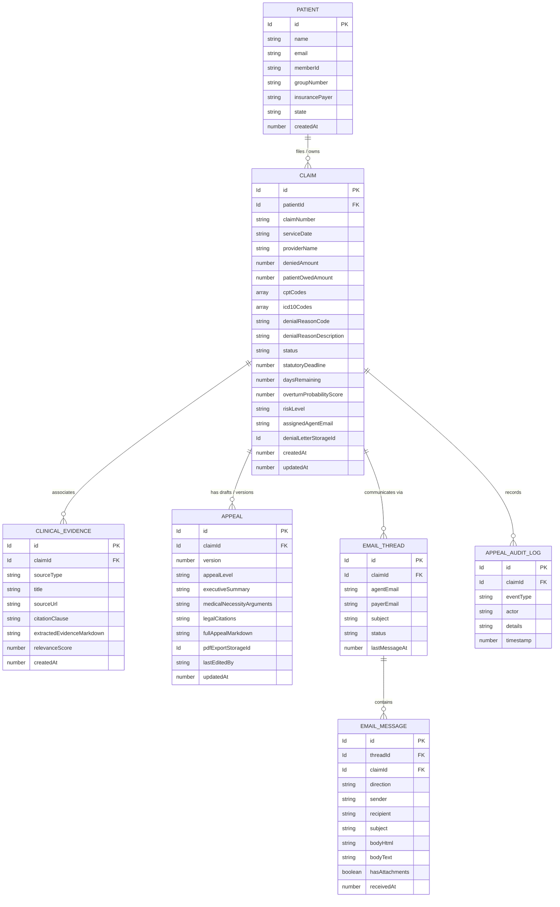
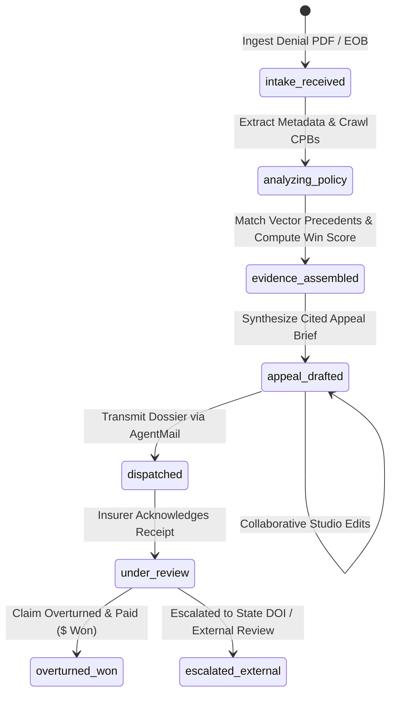

# Data Model: ClaimHero (Autonomous Medical Appeal Sentinel)

**Feature**: `001-appeal-sentinel`  
**Date**: 2026-08-26  
**Status**: Ready for Implementation  

---

## 1. Convex Schema Overview & Entity Relationship Diagram

---

## 2. Table Specifications & Convex Schema Definitions

### 2.1 Table `patients`
Represents the insured patient or policyholder.

| Field | Type | Required | Description |
|---|---|---|---|
| `name` | `v.string()` | Yes | Full legal name of the patient. |
| `email` | `v.string()` | Yes | Contact email address for case updates. |
| `memberId` | `v.string()` | Yes | Insurance member identification number. |
| `groupNumber` | `v.optional(v.string())` | No | Employer or plan group number. |
| `insurancePayer` | `v.string()` | Yes | Insurance company name (e.g. "UnitedHealthcare", "Aetna", "Cigna", "BCBS", "Humana"). |
| `state` | `v.string()` | Yes | State of jurisdiction (determines statutory DOI review windows). |
| `createdAt` | `v.number()` | Yes | Unix timestamp in milliseconds. |

**Indexes**:
- `.index("by_email", ["email"])`
- `.index("by_payer", ["insurancePayer"])`

---

### 2.2 Table `claims`
The core appeal case record.

| Field | Type | Required | Description |
|---|---|---|---|
| `patientId` | `v.id("patients")` | Yes | Reference to patient. |
| `claimNumber` | `v.string()` | Yes | Payer claim reference number (e.g., "CLM-8942-UHC"). |
| `serviceDate` | `v.string()` | Yes | Date when medical service was rendered (YYYY-MM-DD). |
| `providerName` | `v.string()` | Yes | Hospital, clinic, or treating physician name. |
| `deniedAmount` | `v.number()` | Yes | Total dollar amount disputed/denied by payer. |
| `patientOwedAmount`| `v.number()` | Yes | Total out-of-pocket amount billed to patient. |
| `cptCodes` | `v.array(v.string())` | Yes | Procedure codes (e.g. `["27447", "73721"]`). |
| `icd10Codes` | `v.array(v.string())` | Yes | Diagnosis codes (e.g. `["M17.11", "Z96.651"]`). |
| `denialReasonCode` | `v.string()` | Yes | Standard denial code (e.g. `CO-50` Not Medically Necessary, `CO-197` Pre-cert Missing). |
| `denialReasonDescription` | `v.string()` | Yes | Extracted explanation text from denial letter. |
| `status` | `v.string()` | Yes | Enum: `intake_received`, `analyzing_policy`, `evidence_assembled`, `appeal_drafted`, `dispatched`, `under_review`, `overturned_won`, `escalated_external`. |
| `statutoryDeadline` | `v.number()` | Yes | Unix timestamp of statutory filing cutoff (e.g., 180 days from denial date). |
| `daysRemaining` | `v.number()` | Yes | Precalculated days remaining until statutory deadline. |
| `overturnProbabilityScore` | `v.optional(v.number())` | No | AI-calculated win likelihood score (0 to 100). |
| `riskLevel` | `v.optional(v.string())` | No | Enum: `high_confidence` (80-100), `moderate` (50-79), `complex_litigation` (<50). |
| `assignedAgentEmail` | `v.string()` | Yes | Dedicated AgentMail inbox (e.g. `appeal-claim-8942@claimhero.agentmail.com`). |
| `denialLetterStorageId` | `v.optional(v.id("_storage"))` | No | Convex File Storage ID for original denial letter PDF. |
| `createdAt` | `v.number()` | Yes | Timestamp of intake. |
| `updatedAt` | `v.number()` | Yes | Timestamp of last modification. |

**Indexes**:
- `.index("by_status", ["status"])`
- `.index("by_patient", ["patientId"])`
- `.index("by_deadline", ["statutoryDeadline"])`
- `.index("by_claim_number", ["claimNumber"])`

---

### 2.3 Table `clinicalEvidences`
Clinical policy excerpts, FDA package inserts, PubMed studies, and overturned precedents.

| Field | Type | Required | Description |
|---|---|---|---|
| `claimId` | `v.id("claims")` | Yes | Foreign key to claim. |
| `sourceType` | `v.string()` | Yes | Enum: `payer_cpb`, `fda_package_insert`, `pubmed_study`, `nccn_guideline`, `legal_precedent`. |
| `title` | `v.string()` | Yes | Document title (e.g. "UHC Policy 2024T001: Knee Arthroplasty Criteria"). |
| `sourceUrl` | `v.optional(v.string())` | No | Web citation URL. |
| `citationClause` | `v.string()` | Yes | Specific section/clause identifier (e.g., "Section 3.2.1: Conservative Therapy Exception"). |
| `extractedEvidenceMarkdown` | `v.string()` | Yes | Relevant excerpt of clinical necessity criteria. |
| `relevanceScore` | `v.number()` | Yes | Clinical alignment score (0.00 to 1.00) evaluated by `gpt-5-nano`. |
| `createdAt` | `v.number()` | Yes | Ingestion timestamp. |

**Indexes**:
- `.index("by_claim", ["claimId"])`
- `.index("by_claim_source", ["claimId", "sourceType"])`
- `.index("by_source", ["sourceType"])`

---

### 2.4 Table `appeals`
Synthesized multi-page legal and clinical appeal briefs.

| Field | Type | Required | Description |
|---|---|---|---|
| `claimId` | `v.id("claims")` | Yes | Foreign key to claim. |
| `version` | `v.number()` | Yes | Iteration version (1, 2, 3...). |
| `appealLevel` | `v.string()` | Yes | Enum: `level_1_internal`, `level_2_grievance`, `level_3_external_state_review`. |
| `executiveSummary` | `v.string()` | Yes | High-level summary of denial challenge. |
| `medicalNecessityArguments`| `v.string()` | Yes | Clinical justification citing CPB & FDA standards. |
| `legalCitations` | `v.string()` | Yes | Statutory rights citations (ERISA 29 CFR § 2560.503-1, ACA). |
| `fullAppealMarkdown` | `v.string()` | Yes | Complete formatted appeal document for export/dispatch. |
| `pdfExportStorageId` | `v.optional(v.id("_storage"))` | No | Storage reference for exported PDF dossier. |
| `lastEditedBy` | `v.string()` | Yes | User or "ClaimHero AI Sentinel". |
| `updatedAt` | `v.number()` | Yes | Last edit timestamp. |

**Indexes**:
- `.index("by_claim", ["claimId"])`

---

### 2.5 Table `emailThreads` & `emailMessages`
Autonomous two-way correspondence with payer grievance departments.

**Table `emailThreads`**:
- `claimId`: `v.id("claims")`
- `agentEmail`: `v.string()`
- `payerEmail`: `v.string()`
- `subject`: `v.string()`
- `status`: `v.string()` (`active`, `dispatched`, `response_received`, `resolved`)
- `lastMessageAt`: `v.number()`
- Indexes: `.index("by_claim", ["claimId"])`, `.index("by_agent_email", ["agentEmail"])`

**Table `emailMessages`**:
- `threadId`: `v.id("emailThreads")`
- `claimId`: `v.id("claims")`
- `direction`: `v.string()` (`inbound`, `outbound`)
- `sender`: `v.string()`
- `recipient`: `v.string()`
- `subject`: `v.string()`
- `bodyHtml`: `v.string()`
- `bodyText`: `v.string()`
- `hasAttachments`: `v.boolean()`
- `receivedAt`: `v.number()`
- Indexes: `.index("by_thread", ["threadId"])`, `.index("by_claim", ["claimId"])`

---

### 2.6 Table `appealAuditLogs`
Immutable event trail tracking all claim milestones.

- `claimId`: `v.id("claims")`
- `eventType`: `v.string()` (e.g. `denial_ingested`, `policy_crawled`, `overturn_score_computed`, `appeal_edited`, `appeal_dispatched`, `decision_recorded`)
- `actor`: `v.string()` (e.g., "Patient", "Advocate", "OpenAI Sentinel Action", "Firecrawl Scraper", "AgentMail Dispatcher")
- `details`: `v.string()` (Human-readable summary of the action)
- `timestamp`: `v.number()`
- Indexes: `.index("by_claim", ["claimId"])`, `.index("by_timestamp", ["timestamp"])`

---

## 3. Claim State Transition Lifecycle

